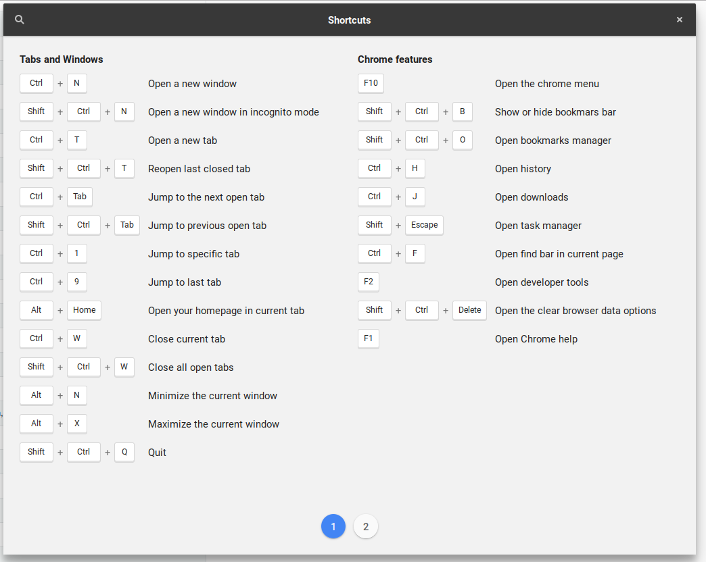

# shortcutception

> Linux GTK application that provides an overlay window with the list of shortcuts for the current focused application. Its a shortcut for shortcuts. Inspired by Mac OS applications [CheatSheet](https://mediaatelier.com/CheatSheet/) and [pretzel](https://github.com/amiechen/pretzel).



This was tested on Ubuntu 18.04.

## System Requirements

* Python 2.7
* GTK > 3.14
* AppIndicator3

## Build

```
python main.py
```

## Supported Applications

Right now, this application supports displaying shortcuts for:

* Gedit
* Google Chrome
* Visual Studio Code

More applications will be added later. Contributions are always welcome.

## How do I add / change shortcuts?

Shortcuts are configured in YAML files in the data/shortcuts directory of the source code. The files in that directory are copied to ~/.config/shortcuts-overlay/shortcuts when starting the application for the first time.

You can add your own of modify existing ones by adding a new file to the config directory.

The filename should be the name of the executable of the application. You can get it from the command line like so:

* Get the pid of your application. (Ex: ```ps ax | grep firefox```)
* Run ```cat /proc/{pid}/comm```. The value displayed there should be the name of your shortcuts file.

The yaml file should have the following structure (taken from Gedit shortcuts file):

```yml
Tabs:
  - Switch to the next tab to the left: <Control><Alt>Up
  - Switch to the next tab to the right:  <Control><Alt>Right
  - Close tab:  <Control>W
  - Save All tabs: <Control><Shift>L
  - Close All tabs: <Control><Shift>W
  - Reopen the most recently closed tab: <Control><Shift>T
  - Jump to nth tab: <Alt>N
  - New Tab Group: <Contol><Alt>N
  - Previous tab Group: <Shift><Ctrl><Alt>Up
  - Next tab group: <Shift><Control><Alt>Down

Working with files:
  - Create a new document in a new window: <Control>N
  - Create a new document in a new tab: <Control>T
  - Open a document: <Control>O
  - Open the quick open window: <Alt>O
  - Save the current document: <Control>S
  - Save the current document with a new filename: <Control><Shift>S
  - Print the current document: <Control>P
  - Print preview: <Control><Shift>P
  - Close the current document: <Control>W
  - Quit: <Control>Q
```

* This format is the same from [Pretzel](https://github.com/amiechen/pretzel).
* The shortcut combination should follow a pattern supported by "gtk_accelerator_parse" Ex: “<Control>a” or “<Shift><Alt>F1”.

## Todo

* Build a proper installer (pip, deb, flatpak).
* Add more applications.

## Contributing

* All contributions are welcome. Please read [CONTRIBUTING.md](CONTRIBUTING.md) for more details.

## License

MIT

